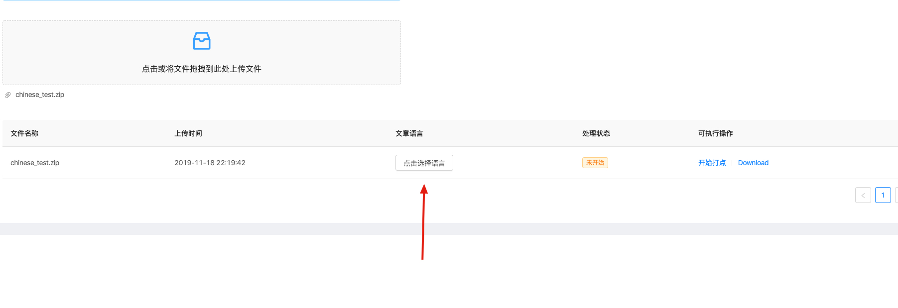

# 文本对齐 

## 环境要求
- 操作系统 : linux MacOs 
- 软件依赖 : mongo kaldi（https://github.com/kaldi-asr/kaldi） 
python 3.7

### 部署语音对齐模型
1. 安装和编译kaldi环境
2. git clone git@github.com:LongmaoTeamTf//audio_manager_model 解压tfaligner.tar.gz将tfaligner文件夹拷贝至kaldi的egs目录下  
3. 打开tfaligner目录  
4. 创建steps和utils软链接：  
    ```shell 
        ln -s ../wsj/s5/steps ./steps
        ln -s ../wsj/s5/utils ./utils
    ```
5. 部署完成

### 部署应用
操作步骤 ： 
- 安装依赖

` 
pip install
`
- 设置模型位置
    - audio_manager_api/config/dev_config.py或者 audio_manager_api/config/pro_config.py文件内的
    - ENGLIST_KALDI_PATH(英文模型位置)
    - CHINESE_KALDI_PATH(中文模型位置)
- 在 audio_manager_api ： 执行python app.py  

- 访问页面 /page/chineseAligner

## AI打点，文本对齐操作
操作流程：
- 上传打包
    - 将音频文件和文本文件压缩到同一个zip文件
    - 文件不要包含空格
    - 上传
- 选择文章语言，
- 点击开始转换，等待进度条满，可以下载文件

使用截图如下：
  




# MIT LICENSE

Copyright 2019 Thefair http://opensource.org/licenses/MIT

Permission is hereby granted, free of charge, to any person obtaining a copy of this software and associated documentation files (the "Software"), to deal in the Software without restriction, including without limitation the rights to use, copy, modify, merge, publish, distribute, sublicense, and/or sell copies of the Software, and to permit persons to whom the Software is furnished to do so, subject to the following conditions:

The above copyright notice and this permission notice shall be included in all copies or substantial portions of the Software.

THE SOFTWARE IS PROVIDED "AS IS", WITHOUT WARRANTY OF ANY KIND, EXPRESS OR IMPLIED, INCLUDING BUT NOT LIMITED TO THE WARRANTIES OF MERCHANTABILITY, FITNESS FOR A PARTICULAR PURPOSE AND NONINFRINGEMENT. IN NO EVENT SHALL THE AUTHORS OR COPYRIGHT HOLDERS BE LIABLE FOR ANY CLAIM, DAMAGES OR OTHER LIABILITY, WHETHER IN AN ACTION OF CONTRACT, TORT OR OTHERWISE, ARISING FROM, OUT OF OR IN CONNECTION WITH THE SOFTWARE OR THE USE OR OTHER DEALINGS IN THE SOFTWARE.